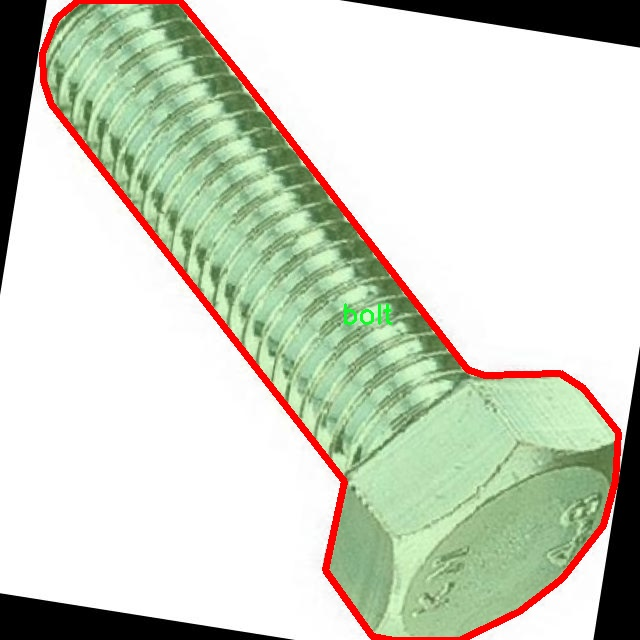

# 机械零件图像分割系统源码＆数据集分享
 [yolov8-seg-C2f-RFCAConv＆yolov8-seg-C2f-Faster等50+全套改进创新点发刊_一键训练教程_Web前端展示]

### 1.研究背景与意义

项目参考[ILSVRC ImageNet Large Scale Visual Recognition Challenge](https://gitee.com/YOLOv8_YOLOv11_Segmentation_Studio/projects)

项目来源[AAAI Global Al lnnovation Contest](https://kdocs.cn/l/cszuIiCKVNis)

研究背景与意义

随着工业自动化和智能制造的迅速发展，机械零件的检测与识别技术在生产流程中扮演着越来越重要的角色。传统的人工检测方法不仅效率低下，而且容易受到人为因素的影响，导致误判和漏判的情况频繁发生。因此，开发高效、准确的机械零件图像分割系统成为了行业内的迫切需求。近年来，深度学习技术的快速进步为图像处理领域带来了革命性的变化，尤其是目标检测和图像分割任务。YOLO（You Only Look Once）系列模型因其高效性和实时性而受到广泛关注，其中YOLOv8作为最新版本，进一步提升了检测精度和速度，成为研究者们探索图像分割应用的理想选择。

本研究旨在基于改进的YOLOv8模型，构建一个针对机械零件的图像分割系统。我们使用的数据集包含3400张图像，涵盖了四类机械零件：螺栓、螺母、物体和螺钉。这些零件在机械制造和装配过程中是不可或缺的，准确的识别和分割能够显著提高生产效率和产品质量。通过对这些零件进行精确的实例分割，系统能够实现对每个零件的独立识别，从而为后续的自动化装配、质量检测等环节提供可靠的数据支持。

在现有的图像分割技术中，YOLOv8模型以其卓越的性能脱颖而出，但在特定应用场景下仍然存在一定的局限性。例如，面对复杂背景、光照变化和零件重叠等情况，模型的分割效果可能会受到影响。因此，本研究将对YOLOv8进行改进，结合数据增强、迁移学习等技术，提升模型在机械零件图像分割任务中的表现。通过对模型结构的优化和训练策略的调整，我们期望能够提高系统的鲁棒性和准确性，使其在实际应用中具备更强的适应能力。

此外，本研究的意义不仅体现在技术层面，更在于推动机械制造行业的智能化转型。通过引入先进的图像分割技术，可以实现对生产线的实时监控和智能管理，降低人工成本，提高生产效率。同时，系统的成功应用将为其他领域的图像分割任务提供借鉴，促进深度学习技术在更广泛场景中的应用。

综上所述，基于改进YOLOv8的机械零件图像分割系统的研究具有重要的理论价值和实际意义。它不仅为机械零件的自动化检测提供了新的解决方案，也为深度学习在工业领域的应用探索开辟了新的方向。通过本研究的深入推进，我们期望能够为机械制造行业的智能化发展贡献一份力量，同时为相关研究提供有益的参考和启示。

### 2.图片演示


##### 注意：由于此博客编辑较早，上面“2.图片演示”和“3.视频演示”展示的系统图片或者视频可能为老版本，新版本在老版本的基础上升级如下：（实际效果以升级的新版本为准）

  （1）适配了YOLOV8的“目标检测”模型和“实例分割”模型，通过加载相应的权重（.pt）文件即可自适应加载模型。

  （2）支持“图片识别”、“视频识别”、“摄像头实时识别”三种识别模式。

  （3）支持“图片识别”、“视频识别”、“摄像头实时识别”三种识别结果保存导出，解决手动导出（容易卡顿出现爆内存）存在的问题，识别完自动保存结果并导出到tempDir中。

  （4）支持Web前端系统中的标题、背景图等自定义修改，后面提供修改教程。

  另外本项目提供训练的数据集和训练教程,暂不提供权重文件（best.pt）,需要您按照教程进行训练后实现图片演示和Web前端界面演示的效果。

### 3.视频演示

[3.1 视频演示](https://www.bilibili.com/video/BV1Ft2BYwEjN/)

### 4.数据集信息展示

##### 4.1 本项目数据集详细数据（类别数＆类别名）

nc: 4
names: ['bolt', 'nut', 'object', 'screw']


##### 4.2 本项目数据集信息介绍

数据集信息展示

在现代工业制造中，机械零件的自动识别与分割是提升生产效率和产品质量的重要环节。为此，我们构建了一个名为“mpc”的数据集，旨在为改进YOLOv8-seg的机械零件图像分割系统提供高质量的训练数据。该数据集专注于四种常见的机械零件，具体包括：螺栓（bolt）、螺母（nut）、物体（object）和螺丝（screw）。通过精心标注和多样化的图像采集，我们力求在多种环境下反映这些零件的真实特征，从而增强模型的泛化能力。

“mpc”数据集的构建过程始于对机械零件的深入分析。我们首先确定了四个主要类别，这些类别在机械装配和维护中极为常见。螺栓和螺母作为连接件，广泛应用于各种机械结构中，而螺丝则是固定和连接的关键元件。为了确保数据集的多样性，我们从不同的角度、光照条件和背景环境中采集了大量图像。这些图像不仅包括单个零件的特写，还涵盖了它们在实际应用场景中的组合和排列，确保模型能够在不同情况下准确识别和分割这些零件。

在数据标注方面，我们采用了专业的标注工具，确保每一张图像中的机械零件都被准确地框定和标记。每个类别的零件都经过严格的质量控制，以保证标注的一致性和准确性。这种细致的标注工作使得“mpc”数据集不仅适用于基础的图像分割任务，还能为复杂的场景理解提供支持。我们相信，经过精确标注的图像数据将为YOLOv8-seg模型的训练提供坚实的基础，进而提升其在实际应用中的表现。

此外，数据集的构建还考虑到了不同应用场景的需求。例如，在某些工业环境中，零件可能会因磨损或污染而表现出不同的外观特征。因此，我们在数据集中引入了不同状态下的零件图像，以增强模型对各种变异的适应能力。这种多样性不仅提升了模型的鲁棒性，也为其在真实世界中的应用奠定了基础。

为了便于研究人员和开发者使用，我们将“mpc”数据集整理成易于访问的格式，并提供详细的文档说明。用户可以方便地下载数据集，并根据自己的需求进行进一步的研究和开发。我们希望通过开放这个数据集，能够激发更多的研究者在机械零件图像分割领域进行创新，推动相关技术的发展。

总之，“mpc”数据集的构建不仅是为了支持YOLOv8-seg模型的训练，更是希望通过提供高质量、多样化的图像数据，促进机械零件自动识别技术的进步。随着工业自动化的不断发展，机械零件的高效识别与分割将成为提升生产效率和降低成本的重要手段，而“mpc”数据集的推出正是这一进程中的重要一步。我们期待着该数据集能够为研究者们提供有价值的资源，助力他们在这一领域取得更大的突破。





### 5.全套项目环境部署视频教程（零基础手把手教学）

[5.1 环境部署教程链接（零基础手把手教学）](https://www.bilibili.com/video/BV1jG4Ve4E9t/?vd_source=bc9aec86d164b67a7004b996143742dc)


[5.2 安装Python虚拟环境创建和依赖库安装视频教程链接（零基础手把手教学）](https://www.bilibili.com/video/BV1nA4VeYEze/?vd_source=bc9aec86d164b67a7004b996143742dc)

### 6.手把手YOLOV8-seg训练视频教程（零基础小白有手就能学会）

[6.1 手把手YOLOV8-seg训练视频教程（零基础小白有手就能学会）](https://www.bilibili.com/video/BV1cA4VeYETe/?vd_source=bc9aec86d164b67a7004b996143742dc)


按照上面的训练视频教程链接加载项目提供的数据集，运行train.py即可开始训练



     Epoch   gpu_mem       box       obj       cls    labels  img_size
     1/200     0G   0.01576   0.01955  0.007536        22      1280: 100%|██████████| 849/849 [14:42<00:00,  1.04s/it]
               Class     Images     Labels          P          R     mAP@.5 mAP@.5:.95: 100%|██████████| 213/213 [01:14<00:00,  2.87it/s]
                 all       3395      17314      0.994      0.957      0.0957      0.0843

     Epoch   gpu_mem       box       obj       cls    labels  img_size
     2/200     0G   0.01578   0.01923  0.007006        22      1280: 100%|██████████| 849/849 [14:44<00:00,  1.04s/it]
               Class     Images     Labels          P          R     mAP@.5 mAP@.5:.95: 100%|██████████| 213/213 [01:12<00:00,  2.95it/s]
                 all       3395      17314      0.996      0.956      0.0957      0.0845

     Epoch   gpu_mem       box       obj       cls    labels  img_size
     3/200     0G   0.01561    0.0191  0.006895        27      1280: 100%|██████████| 849/849 [10:56<00:00,  1.29it/s]
               Class     Images     Labels          P          R     mAP@.5 mAP@.5:.95: 100%|███████   | 187/213 [00:52<00:00,  4.04it/s]
                 all       3395      17314      0.996      0.957      0.0957      0.0845


### 7.50+种全套YOLOV8-seg创新点代码加载调参视频教程（一键加载写好的改进模型的配置文件）

[7.1 50+种全套YOLOV8-seg创新点代码加载调参视频教程（一键加载写好的改进模型的配置文件）](https://www.bilibili.com/video/BV1Hw4VePEXv/?vd_source=bc9aec86d164b67a7004b996143742dc)

### 8.YOLOV8-seg图像分割算法原理

原始YOLOv8-seg算法原理

YOLOv8-seg作为YOLO系列的最新版本，结合了目标检测与语义分割的优势，标志着计算机视觉领域的又一次重要进步。该算法的设计理念是通过高效的特征提取和多尺度信息融合，来实现对复杂场景中目标的精准定位与分割。YOLOv8-seg的结构主要由输入层、主干网络、颈部网络和头部网络组成，每个部分都经过精心设计，以确保在处理速度和检测精度之间达到最佳平衡。

在输入层，YOLOv8-seg首先对输入图像进行预处理，包括缩放和归一化，以适应模型的输入要求。这一过程不仅确保了图像的尺寸一致性，还通过标准化提高了模型对不同光照和色彩条件的鲁棒性。接下来，主干网络通过一系列卷积操作对图像进行下采样，提取出图像的深层特征。每个卷积层都配备了批归一化和SiLUR激活函数，这种组合有效地加速了训练过程，并增强了模型的非线性表达能力。

主干网络中的C2f模块是YOLOv8-seg的一大亮点。该模块借鉴了YOLOv7中的E-ELAN结构，通过跨层分支连接来增强模型的梯度流。这种设计使得信息能够在不同层之间有效传递，从而改善了特征的学习效果，提升了检测的准确性。主干网络的末尾采用了SPPFl模块，通过三个最大池化层处理多尺度特征，进一步增强了网络的特征抽象能力，使得模型能够更好地适应不同大小和形状的目标。

在颈部网络中，YOLOv8-seg采用了FPNS和PAN结构，这两种结构的结合使得模型能够在不同尺度的特征图之间进行有效的信息融合。FPNS（Feature Pyramid Network）通过自上而下的特征传递，增强了高层特征的语义信息，而PAN（Path Aggregation Network）则通过自下而上的特征融合，提升了低层特征的空间分辨率。这种多尺度特征融合的策略，使得YOLOv8-seg在处理复杂场景时，能够更全面地捕捉到目标的细节信息。

头部网络是YOLOv8-seg的关键部分，采用了解耦的检测头结构。这一结构通过两个并行的卷积分支，分别计算回归和类别的损失，从而实现了更为精确的目标检测和分割。解耦设计的优势在于，它允许模型在回归和分类任务上进行独立优化，减少了任务之间的干扰，提高了整体性能。此外，YOLOv8-seg还引入了Anchor-Free的检测方式，简化了传统目标检测中对锚框的依赖，使得模型在处理不同形状和大小的目标时更加灵活。

YOLOv8-seg的损失函数设计也体现了其在精度和速度上的追求。通过使用CloU损失函数，模型能够更好地处理目标的边界信息，从而在分割任务中获得更高的精度。这种损失函数不仅考虑了目标的类别信息，还对目标的形状和位置进行了有效的建模，使得YOLOv8-seg在复杂背景下的目标分割表现出色。

在实际应用中，YOLOv8-seg展现出了强大的视觉识别能力，尤其在自动化领域的应用潜力巨大。例如，在苹果采摘的场景中，YOLOv8-seg能够快速准确地检测和定位苹果，为自动采摘机器人提供必要的视觉信息。这一过程不仅提高了采摘效率，还降低了人工成本，推动了农业自动化的发展。

综上所述，YOLOv8-seg算法通过其创新的网络结构和高效的特征处理机制，成功地将目标检测与语义分割结合在一起，展现了在复杂场景下的优越性能。随着YOLOv8-seg的不断发展和应用，其在计算机视觉领域的影响力将愈加显著，为未来的研究和应用提供了广阔的前景。


### 9.系统功能展示（检测对象为举例，实际内容以本项目数据集为准）

图9.1.系统支持检测结果表格显示

  图9.2.系统支持置信度和IOU阈值手动调节

  图9.3.系统支持自定义加载权重文件best.pt(需要你通过步骤5中训练获得)

  图9.4.系统支持摄像头实时识别

  图9.5.系统支持图片识别

  图9.6.系统支持视频识别

  图9.7.系统支持识别结果文件自动保存

  图9.8.系统支持Excel导出检测结果数据


### 10.50+种全套YOLOV8-seg创新点原理讲解（非科班也可以轻松写刊发刊，V11版本正在科研待更新）

#### 10.1 由于篇幅限制，每个创新点的具体原理讲解就不一一展开，具体见下列网址中的创新点对应子项目的技术原理博客网址【Blog】：


[10.1 50+种全套YOLOV8-seg创新点原理讲解链接](https://gitee.com/qunmasj/good)

#### 10.2 部分改进模块原理讲解(完整的改进原理见上图和技术博客链接)【如果此小节的图加载失败可以通过CSDN或者Github搜索该博客的标题访问原始博客，原始博客图片显示正常】
### YOLOv8算法原理
YOLOv8算法由Glenn-Jocher 提出，是跟YOLOv3算法、YOLOv5算法一脉相承的，主要的改进点如下:
(1)数据预处理。YOLOv8的数据预处理依旧采用YOLOv5的策略,在训练时，主要采用包括马赛克增强(Mosaic)、混合增强(Mixup)、空间扰动(randomperspective)以及颜色扰动(HSV augment)四个增强手段。
(2)骨干网络结构。YOLOv8的骨干网络结构可从YOLOv5略见一斑，YOLOv5的主干网络的架构规律十分清晰，总体来看就是每用一层步长为2的3×3卷积去降采样特征图，接一个C3模块来进一步强化其中的特征，且C3的基本深度参数分别为“3/6/9/3”，其会根据不同规模的模型的来做相应的缩放。在的YOLOv8中，大体上也还是继承了这一特点，原先的C3模块均被替换成了新的C2f模块，C2f 模块加入更多的分支，丰富梯度回传时的支流。下面展示了YOLOv8的C2f模块和YOLOv5的C3模块，其网络结构图所示。


(3)FPN-PAN结构。YOLOv8仍采用FPN+PAN结构来构建YOLO的特征金字塔，使多尺度信息之间进行充分的融合。除了FPN-PAN里面的C3模块被替换为C2f模块外，其余部分与YOLOv5的FPN-PAN结构基本一致。
(4)Detection head结构。从 YOLOv3到 YOLOv5，其检测头一直都是“耦合”(Coupled)的,即使用一层卷积同时完成分类和定位两个任务，直到YOLOX的问世， YOLO系列才第一次换装“解耦头”(Decoupled Head)。YOLOv8也同样也采用了解耦头的结构，两条并行的分支分别取提取类别特征和位置特征，然后各用一层1x1卷积完成分类和定位任务。YOLOv8整体的网络结构由图所示。


(5)标签分配策略。尽管YOLOv5设计了自动聚类候选框的一些功能，但是聚类候选框是依赖于数据集的。若数据集不够充分，无法较为准确地反映数据本身的分布特征，聚类出来的候选框也会与真实物体尺寸比例悬殊过大。YOLOv8没有采用候选框策略，所以解决的问题就是正负样本匹配的多尺度分配。不同于YOLOX所使用的 SimOTA，YOLOv8在标签分配问题上采用了和YOLOv6相同的TOOD策略，是一种动态标签分配策略。YOLOv8只用到了targetboze。和target scores，未含是否有物体预测，故 YOLOv8的损失就主要包括两大部分∶类别损失和位置损失。对于YOLOv8，其分类损失为VFLLoss(Varifocal Loss)，其回归损失为CIoU Loss 与 DFL Loss 的形式。
其中 Varifocal Loss定义如下:


其中p为预测的类别得分，p ∈ [0.1]。q为预测的目标分数(若为真实类别，则q为预测和真值的 loU;若为其他类别。q为0 )。VFL Loss使用不对称参数来对正负样本进行加权，通过只对负样本进行衰减，达到不对等的处理前景和背景对损失的贡献。对正样本，使用q进行了加权，如果正样本的GTiou很高时,则对损失的贡献更大一些，可以让网络聚焦于那些高质量的样本上，即训练高质量的正例对AP的提升比低质量的更大一些。对负样本，使用p进行了降权，降低了负例对损失的贡献，因负样本的预测p在取次幂后会变得更小，这样就能够降低负样本对损失的整体贡献。

### 动态蛇形卷积Dynamic Snake Convolution

参考论文： 2307.08388.pdf (arxiv.org)

血管、道路等拓扑管状结构的精确分割在各个领域都至关重要，确保下游任务的准确性和效率。 然而，许多因素使任务变得复杂，包括薄的局部结构和可变的全局形态。在这项工作中，我们注意到管状结构的特殊性，并利用这些知识来指导我们的 DSCNet 在三个阶段同时增强感知：特征提取、特征融合、 和损失约束。 首先，我们提出了一种动态蛇卷积，通过自适应地关注细长和曲折的局部结构来准确捕获管状结构的特征。 随后，我们提出了一种多视图特征融合策略，以补充特征融合过程中多角度对特征的关注，确保保留来自不同全局形态的重要信息。 最后，提出了一种基于持久同源性的连续性约束损失函数，以更好地约束分割的拓扑连续性。 2D 和 3D 数据集上的实验表明，与多种方法相比，我们的 DSCNet 在管状结构分割任务上提供了更好的准确性和连续性。 我们的代码是公开的。 
主要的挑战源于细长微弱的局部结构特征与复杂多变的全局形态特征。本文关注到管状结构细长连续的特点，并利用这一信息在神经网络以下三个阶段同时增强感知：特征提取、特征融合和损失约束。分别设计了动态蛇形卷积（Dynamic Snake Convolution），多视角特征融合策略与连续性拓扑约束损失。 

我们希望卷积核一方面能够自由地贴合结构学习特征，另一方面能够在约束条件下不偏离目标结构太远。在观察管状结构的细长连续的特征后，脑海里想到了一个动物——蛇。我们希望卷积核能够像蛇一样动态地扭动，来贴合目标的结构。

我们希望卷积核一方面能够自由地贴合结构学习特征，另一方面能够在约束条件下不偏离目标结构太远。在观察管状结构的细长连续的特征后，脑海里想到了一个动物——蛇。我们希望卷积核能够像蛇一样动态地扭动，来贴合目标的结构。


### DCNV2融入YOLOv8
DCN和DCNv2（可变性卷积）
网上关于两篇文章的详细描述已经很多了，我这里具体的细节就不多讲了，只说一下其中实现起来比较困惑的点。（黑体字会讲解）

DCNv1解决的问题就是我们常规的图像增强，仿射变换（线性变换加平移）不能解决的多种形式目标变换的几何变换的问题。如下图所示。

可变性卷积的思想很简单，就是讲原来固定形状的卷积核变成可变的。如下图所示：


首先来看普通卷积，以3x3卷积为例对于每个输出y(p0)，都要从x上采样9个位置，这9个位置都在中心位置x(p0)向四周扩散得到的gird形状上，(-1,-1)代表x(p0)的左上角，(1,1)代表x(p0)的右下角，其他类似。

用公式表示如下：


可变性卷积Deformable Conv操作并没有改变卷积的计算操作，而是在卷积操作的作用区域上，加入了一个可学习的参数∆pn。同样对于每个输出y(p0)，都要从x上采样9个位置，这9个位置是中心位置x(p0)向四周扩散得到的，但是多了 ∆pn，允许采样点扩散成非gird形状。


偏移量是通过对原始特征层进行卷积得到的。比如输入特征层是w×h×c，先对输入的特征层进行卷积操作，得到w×h×2c的offset field。这里的w和h和原始特征层的w和h是一致的，offset field里面的值是输入特征层对应位置的偏移量，偏移量有x和y两个方向，所以offset field的channel数是2c。offset field里的偏移量是卷积得到的，可能是浮点数，所以接下来需要通过双向性插值计算偏移位置的特征值。在偏移量的学习中，梯度是通过双线性插值来进行反向传播的。
看到这里是不是还是有点迷茫呢？那到底程序上面怎么实现呢？


事实上由上面的公式我们可以看得出来∆pn这个偏移量是加在原像素点上的，但是我们怎么样从代码上对原像素点加这个量呢？其实很简单，就是用一个普通的卷积核去跟输入图片（一般是输入的feature_map）卷积就可以了卷积核的数量是2N也就是23*3==18（前9个通道是x方向的偏移量，后9个是y方向的偏移量），然后把这个卷积的结果与正常卷积的结果进行相加就可以了。
然后又有了第二个问题，怎么样反向传播呢？为什么会有这个问题呢？因为求出来的偏移量+正常卷积输出的结果往往是一个浮点数，浮点数是无法对应到原图的像素点的，所以自然就想到了双线性差值的方法求出浮点数对应的浮点像素点。


#### DCN v2
对于positive的样本来说，采样的特征应该focus在RoI内，如果特征中包含了过多超出RoI的内容，那么结果会受到影响和干扰。而negative样本则恰恰相反，引入一些超出RoI的特征有助于帮助网络判别这个区域是背景区域。

DCNv1引入了可变形卷积，能更好的适应目标的几何变换。但是v1可视化结果显示其感受野对应位置超出了目标范围，导致特征不受图像内容影响（理想情况是所有的对应位置分布在目标范围以内）。

为了解决该问题：提出v2, 主要有

1、扩展可变形卷积，增强建模能力
2、提出了特征模拟方案指导网络培训：feature mimicking scheme

上面这段话是什么意思呢，通俗来讲就是，我们的可变性卷积的区域大于目标所在区域，所以这时候就会对非目标区域进行错误识别。

所以自然能想到的解决方案就是加入权重项进行惩罚。（至于这个实现起来就比较简单了，直接初始化一个权重然后乘(input+offsets)就可以了）


可调节的RoIpooling也是类似的，公式如下：


### 11.项目核心源码讲解（再也不用担心看不懂代码逻辑）

#### 11.1 ui.py

以下是代码的核心部分，并附上详细的中文注释：

```python
import sys
import subprocess

def run_script(script_path):
    """
    使用当前 Python 环境运行指定的脚本。

    Args:
        script_path (str): 要运行的脚本路径

    Returns:
        None
    """
    # 获取当前 Python 解释器的路径
    python_path = sys.executable

    # 构建运行命令，使用 streamlit 运行指定的脚本
    command = f'"{python_path}" -m streamlit run "{script_path}"'

    # 执行命令
    result = subprocess.run(command, shell=True)
    # 检查命令执行的返回码，如果不为0，表示执行出错
    if result.returncode != 0:
        print("脚本运行出错。")

# 实例化并运行应用
if __name__ == "__main__":
    # 指定要运行的脚本路径
    script_path = "web.py"  # 这里可以直接指定脚本名称，假设在当前目录下

    # 调用函数运行脚本
    run_script(script_path)
```

### 代码分析：
1. **导入模块**：
   - `sys`：用于获取当前 Python 解释器的路径。
   - `subprocess`：用于执行外部命令。

2. **`run_script` 函数**：
   - 接收一个参数 `script_path`，表示要运行的 Python 脚本的路径。
   - 使用 `sys.executable` 获取当前 Python 解释器的路径，以确保在当前环境中运行脚本。
   - 构建命令字符串，使用 `streamlit` 运行指定的脚本。
   - 使用 `subprocess.run` 执行命令，并检查返回码以判断脚本是否成功运行。

3. **主程序块**：
   - 在脚本作为主程序运行时，指定要运行的脚本路径（这里假设为 `web.py`）。
   - 调用 `run_script` 函数来执行指定的脚本。 

### 注意事项：
- 确保 `web.py` 脚本存在于当前工作目录中。
- 需要安装 `streamlit` 库以确保脚本能够正常运行。

这个文件是一个名为 `ui.py` 的 Python 脚本，主要功能是运行一个指定的 Python 脚本（在这里是 `web.py`），并且使用当前的 Python 环境来执行它。文件中首先导入了一些必要的模块，包括 `sys`、`os` 和 `subprocess`，以及一个自定义的函数 `abs_path`，这个函数来自于 `QtFusion.path` 模块，可能用于获取文件的绝对路径。

在 `run_script` 函数中，首先获取当前 Python 解释器的路径，这通过 `sys.executable` 实现。接着，构建一个命令字符串，这个命令使用 `streamlit` 来运行指定的脚本。`streamlit` 是一个用于构建数据应用的框架，因此可以推测 `web.py` 是一个使用 `streamlit` 编写的应用。

然后，使用 `subprocess.run` 来执行这个命令。`shell=True` 参数允许命令在一个新的 shell 中运行。执行完命令后，检查返回的状态码，如果不为零，表示脚本运行出错，程序会打印出相应的错误信息。

在文件的最后部分，使用 `if __name__ == "__main__":` 这一结构来确保只有在直接运行该脚本时才会执行后面的代码。在这里，指定了要运行的脚本路径 `web.py`，并调用 `run_script` 函数来执行它。

总的来说，这个脚本的主要目的是提供一个简单的接口，通过命令行运行一个 `streamlit` 应用，便于开发和测试。

#### 11.2 ultralytics\models\sam\modules\tiny_encoder.py

以下是经过简化和注释的核心代码部分，主要保留了 TinyViT 模型的结构和功能。

```python
import torch
import torch.nn as nn
import torch.nn.functional as F

class Conv2d_BN(nn.Sequential):
    """一个顺序容器，执行2D卷积操作并随后进行批量归一化。"""

    def __init__(self, in_channels, out_channels, kernel_size=1, stride=1, padding=0):
        """初始化卷积层和批量归一化层。"""
        super().__init__()
        self.add_module('conv', nn.Conv2d(in_channels, out_channels, kernel_size, stride, padding, bias=False))
        self.add_module('bn', nn.BatchNorm2d(out_channels))

class PatchEmbed(nn.Module):
    """将图像嵌入为补丁并投影到指定的嵌入维度。"""

    def __init__(self, in_chans, embed_dim, resolution):
        """初始化补丁嵌入层。"""
        super().__init__()
        img_size = (resolution, resolution)
        self.patches_resolution = (img_size[0] // 4, img_size[1] // 4)  # 每个补丁的分辨率
        self.seq = nn.Sequential(
            Conv2d_BN(in_chans, embed_dim // 2, kernel_size=3, stride=2, padding=1),
            nn.GELU(),  # 激活函数
            Conv2d_BN(embed_dim // 2, embed_dim, kernel_size=3, stride=2, padding=1),
        )

    def forward(self, x):
        """通过补丁嵌入层处理输入张量。"""
        return self.seq(x)

class TinyViTBlock(nn.Module):
    """TinyViT块，应用自注意力和局部卷积。"""

    def __init__(self, dim, num_heads, window_size=7):
        """初始化TinyViT块。"""
        super().__init__()
        self.attn = nn.MultiheadAttention(dim, num_heads)  # 多头自注意力层
        self.local_conv = Conv2d_BN(dim, dim, kernel_size=3, stride=1, padding=1)  # 局部卷积层
        self.norm1 = nn.LayerNorm(dim)  # 层归一化
        self.norm2 = nn.LayerNorm(dim)

    def forward(self, x):
        """执行前向传播，应用自注意力和局部卷积。"""
        x = self.norm1(x)  # 归一化
        x, _ = self.attn(x, x, x)  # 自注意力
        x = self.norm2(x)  # 再次归一化
        x = self.local_conv(x)  # 局部卷积
        return x

class TinyViT(nn.Module):
    """TinyViT模型，用于视觉任务。"""

    def __init__(self, img_size=224, in_chans=3, num_classes=1000, embed_dims=[96, 192, 384, 768], depths=[2, 2, 6, 2]):
        """初始化TinyViT模型。"""
        super().__init__()
        self.patch_embed = PatchEmbed(in_chans, embed_dims[0], img_size)  # 初始化补丁嵌入层
        self.layers = nn.ModuleList()  # 存储各层

        for i in range(len(depths)):
            # 构建每一层的TinyViT块
            self.layers.append(nn.ModuleList([TinyViTBlock(embed_dims[i], num_heads=embed_dims[i] // 32) for _ in range(depths[i])]))

        self.head = nn.Linear(embed_dims[-1], num_classes) if num_classes > 0 else nn.Identity()  # 分类头

    def forward(self, x):
        """执行前向传播，经过补丁嵌入和各层。"""
        x = self.patch_embed(x)  # 输入经过补丁嵌入
        for layer in self.layers:
            for block in layer:
                x = block(x)  # 逐层处理
        return self.head(x)  # 输出分类结果
```

### 代码注释说明：
1. **Conv2d_BN**: 这个类定义了一个包含卷积层和批量归一化层的顺序容器，通常用于图像处理中的特征提取。
2. **PatchEmbed**: 该类将输入图像分割成小块（补丁），并通过卷积层将其嵌入到指定的维度中。
3. **TinyViTBlock**: 这个模块包含自注意力机制和局部卷积操作，主要用于特征提取和增强。
4. **TinyViT**: 这是整个模型的主要结构，包含补丁嵌入层和多个TinyViT块，最后通过一个线性层进行分类。

以上代码提供了TinyViT模型的核心结构，适用于视觉任务。

这个程序文件定义了一个名为 `TinyViT` 的深度学习模型，主要用于计算机视觉任务。它是基于视觉变换器（Vision Transformer, ViT）架构的一个轻量级实现，结合了卷积神经网络（CNN）的一些元素。以下是对代码的详细讲解。

首先，文件导入了一些必要的库，包括 PyTorch 的核心模块和一些工具函数。接着，定义了一些基础组件，例如 `Conv2d_BN` 类，它是一个顺序容器，包含一个二维卷积层和一个批量归一化层。这种结构在深度学习中非常常见，用于提取特征并加速训练。

接下来是 `PatchEmbed` 类，它负责将输入图像分割成小块（patches），并将这些小块映射到一个指定的嵌入维度。这个过程有助于将图像信息转化为适合变换器处理的格式。

`MBConv` 类实现了移动反向瓶颈卷积层（Mobile Inverted Bottleneck Conv），这是 EfficientNet 架构中的一个重要组成部分。它通过逐层的卷积和激活函数，提取输入特征并进行变换。

`PatchMerging` 类用于合并相邻的小块，并将其投影到新的维度，这对于降低特征图的分辨率非常有用。

`ConvLayer` 类是一个包含多个 MBConv 层的卷积层，可以选择性地对输出进行下采样，并支持梯度检查点，以节省内存。

`Mlp` 类实现了多层感知机（MLP），通常用于变换器架构中，包含了层归一化和两个全连接层。

`Attention` 类实现了多头注意力机制，支持空间感知，能够根据空间分辨率应用注意力偏置。这个模块在处理图像时非常重要，因为它可以帮助模型关注不同区域的重要性。

`TinyViTBlock` 类是 TinyViT 的基本构建块，结合了自注意力机制和局部卷积。它通过注意力机制处理输入，并在此基础上应用局部卷积，以进一步提取特征。

`BasicLayer` 类表示 TinyViT 的一个基本层，包含多个 TinyViTBlock，并可选择性地进行下采样。

`LayerNorm2d` 类实现了二维层归一化，适用于卷积神经网络中的特征图。

最后，`TinyViT` 类是整个模型的核心，负责初始化各个层和组件。它接受多个参数，如输入图像大小、输入通道数、类别数、嵌入维度、深度、注意力头数等。该类还实现了前向传播的方法，将输入数据通过各个层进行处理，最终输出分类结果。

总的来说，这个文件实现了一个结构清晰、功能强大的视觉变换器模型，适用于各种计算机视觉任务，如图像分类、目标检测等。通过结合卷积层和变换器的优点，TinyViT 模型在保持高效性的同时，能够有效地提取图像特征。

#### 11.3 ultralytics\utils\dist.py

以下是经过简化和注释的核心代码部分：

```python
import os
import re
import shutil
import socket
import sys
import tempfile
from pathlib import Path

from . import USER_CONFIG_DIR
from .torch_utils import TORCH_1_9

def find_free_network_port() -> int:
    """
    查找本地主机上一个空闲的网络端口。
    
    这个函数在单节点训练时非常有用，因为我们不想连接到真实的主节点，但需要设置
    `MASTER_PORT` 环境变量。
    """
    with socket.socket(socket.AF_INET, socket.SOCK_STREAM) as s:
        s.bind(('127.0.0.1', 0))  # 绑定到本地地址和一个随机端口
        return s.getsockname()[1]  # 返回绑定的端口号


def generate_ddp_file(trainer):
    """
    生成一个 DDP 文件并返回其文件名。
    
    DDP（Distributed Data Parallel）文件用于分布式训练，包含训练配置和执行代码。
    """
    # 获取训练器的模块和类名
    module, name = f'{trainer.__class__.__module__}.{trainer.__class__.__name__}'.rsplit('.', 1)

    # 创建 DDP 文件的内容
    content = f'''overrides = {vars(trainer.args)} \nif __name__ == "__main__":
    from {module} import {name}
    from ultralytics.utils import DEFAULT_CFG_DICT

    cfg = DEFAULT_CFG_DICT.copy()
    cfg.update(save_dir='')   # 处理额外的 'save_dir' 键
    trainer = {name}(cfg=cfg, overrides=overrides)
    trainer.train()'''
    
    # 创建 DDP 目录（如果不存在）
    (USER_CONFIG_DIR / 'DDP').mkdir(exist_ok=True)
    
    # 创建临时文件并写入内容
    with tempfile.NamedTemporaryFile(prefix='_temp_',
                                     suffix=f'{id(trainer)}.py',
                                     mode='w+',
                                     encoding='utf-8',
                                     dir=USER_CONFIG_DIR / 'DDP',
                                     delete=False) as file:
        file.write(content)  # 写入文件内容
    return file.name  # 返回临时文件名


def generate_ddp_command(world_size, trainer):
    """
    生成并返回用于分布式训练的命令。
    
    该命令用于启动多个训练进程。
    """
    import __main__  # 本地导入以避免某些问题
    if not trainer.resume:
        shutil.rmtree(trainer.save_dir)  # 如果不恢复训练，删除保存目录
    
    file = str(Path(sys.argv[0]).resolve())  # 获取当前脚本的绝对路径
    safe_pattern = re.compile(r'^[a-zA-Z0-9_. /\\-]{1,128}$')  # 允许的字符和最大长度
    # 检查文件名是否合法
    if not (safe_pattern.match(file) and Path(file).exists() and file.endswith('.py')):
        file = generate_ddp_file(trainer)  # 生成 DDP 文件
    
    # 选择分布式训练的命令
    dist_cmd = 'torch.distributed.run' if TORCH_1_9 else 'torch.distributed.launch'
    port = find_free_network_port()  # 查找空闲端口
    # 构建命令
    cmd = [sys.executable, '-m', dist_cmd, '--nproc_per_node', f'{world_size}', '--master_port', f'{port}', file]
    return cmd, file  # 返回命令和文件名


def ddp_cleanup(trainer, file):
    """
    如果创建了临时文件，则删除该文件。
    
    这是为了清理不再需要的临时文件。
    """
    if f'{id(trainer)}.py' in file:  # 检查文件名是否包含临时文件的后缀
        os.remove(file)  # 删除临时文件
```

### 代码说明：
1. **find_free_network_port**: 该函数用于查找一个可用的网络端口，通常用于分布式训练时设置 `MASTER_PORT` 环境变量。
  
2. **generate_ddp_file**: 该函数生成一个用于分布式数据并行训练的 Python 文件，文件中包含训练器的配置和训练代码。

3. **generate_ddp_command**: 该函数生成分布式训练的命令，包括指定的进程数量和使用的端口。如果当前脚本不符合要求，则会生成 DDP 文件。

4. **ddp_cleanup**: 该函数用于清理临时文件，确保在训练结束后不会留下不必要的文件。

这个程序文件是一个用于分布式训练的工具，主要用于Ultralytics YOLO框架中。它包含了一些函数，用于查找可用的网络端口、生成分布式数据并行（DDP）文件、生成分布式训练命令以及清理临时文件。

首先，`find_free_network_port`函数用于查找本地主机上可用的网络端口。它创建一个TCP套接字并将其绑定到127.0.0.1的随机端口上，返回该端口号。这在单节点训练时非常有用，因为我们不需要连接到真实的主节点，但仍然需要设置`MASTER_PORT`环境变量。

接下来，`generate_ddp_file`函数用于生成一个DDP文件并返回其文件名。它从传入的训练器对象中提取模块和类名，并构建一个Python脚本的内容，该脚本包含训练器的配置和训练逻辑。然后，它在用户配置目录下创建一个名为'DDP'的文件夹（如果不存在的话），并将生成的内容写入一个临时文件中，最后返回该文件的名称。

`generate_ddp_command`函数用于生成分布式训练的命令。它首先检查训练器是否需要恢复，如果不需要，则删除保存目录。接着，它获取当前脚本的路径，并使用正则表达式检查该路径是否符合安全模式（即是否为有效的Python文件）。如果不符合，则调用`generate_ddp_file`生成一个临时文件。然后，它根据PyTorch的版本选择适当的分布式命令，并调用`find_free_network_port`获取一个可用的端口。最后，它构建并返回一个包含命令和文件名的列表。

最后，`ddp_cleanup`函数用于在训练结束后删除临时文件。如果临时文件的后缀与训练器的ID匹配，则将其删除，以确保不会留下不必要的文件。

总体而言，这个文件提供了一些实用的功能，帮助用户在Ultralytics YOLO框架中进行分布式训练，简化了配置和命令生成的过程。

#### 11.4 train.py

以下是代码中最核心的部分，并附上详细的中文注释：

```python
import os
import torch
import yaml
from ultralytics import YOLO  # 导入YOLO模型

if __name__ == '__main__':  # 确保该模块被直接运行时才执行以下代码
    # 设置训练参数
    workers = 1  # 数据加载的工作进程数
    batch = 8  # 每个批次的样本数量，需根据显存大小调整
    device = "0" if torch.cuda.is_available() else "cpu"  # 检查是否有可用的GPU，若没有则使用CPU

    # 获取数据集配置文件的绝对路径
    data_path = abs_path(f'datasets/data/data.yaml', path_type='current')

    # 将路径格式转换为Unix风格
    unix_style_path = data_path.replace(os.sep, '/')
    # 获取目录路径
    directory_path = os.path.dirname(unix_style_path)

    # 读取YAML文件，保持原有顺序
    with open(data_path, 'r') as file:
        data = yaml.load(file, Loader=yaml.FullLoader)

    # 修改数据集路径
    if 'train' in data and 'val' in data and 'test' in data:
        data['train'] = directory_path + '/train'  # 设置训练集路径
        data['val'] = directory_path + '/val'      # 设置验证集路径
        data['test'] = directory_path + '/test'    # 设置测试集路径

        # 将修改后的数据写回YAML文件
        with open(data_path, 'w') as file:
            yaml.safe_dump(data, file, sort_keys=False)

    # 加载YOLO模型配置文件和预训练权重
    model = YOLO(r"C:\codeseg\codenew\50+种YOLOv8算法改进源码大全和调试加载训练教程（非必要）\改进YOLOv8模型配置文件\yolov8-seg-C2f-Faster.yaml").load("./weights/yolov8s-seg.pt")

    # 开始训练模型
    results = model.train(
        data=data_path,  # 指定训练数据的配置文件路径
        device=device,  # 指定使用的设备（GPU或CPU）
        workers=workers,  # 指定数据加载的工作进程数
        imgsz=640,  # 指定输入图像的大小为640x640
        epochs=100,  # 指定训练的轮数为100
        batch=batch,  # 指定每个批次的样本数量
    )
```

### 代码核心部分解释：
1. **导入必要的库**：导入`os`、`torch`、`yaml`和YOLO模型的相关库。
2. **参数设置**：设置工作进程数、批次大小和设备类型（GPU或CPU）。
3. **数据集路径处理**：获取数据集配置文件的绝对路径，并修改YAML文件中的训练、验证和测试集路径。
4. **模型加载**：加载YOLO模型的配置文件和预训练权重。
5. **模型训练**：调用`model.train()`方法开始训练，传入必要的参数如数据路径、设备、工作进程数、图像大小、训练轮数和批次大小。

该程序文件`train.py`主要用于训练YOLO（You Only Look Once）模型，具体是YOLOv8版本的一个变体。程序首先导入了一些必要的库，包括操作系统库`os`、深度学习框架`torch`、YAML解析库`yaml`以及YOLO模型的实现库`ultralytics`。此外，还导入了一个路径处理模块`abs_path`和用于图形显示的`matplotlib`库。

在程序的主入口部分，首先设置了一些训练参数。`workers`指定了数据加载的工作进程数量，`batch`设置了每个批次的样本数量，`device`则根据是否有可用的GPU来选择使用GPU还是CPU进行训练。

接下来，程序构建了数据集配置文件的绝对路径，文件名为`data.yaml`，并将路径格式转换为Unix风格。通过读取该YAML文件，程序获取了数据集的相关信息，并修改了其中的训练、验证和测试数据的路径，以确保它们指向正确的目录。修改后的数据将被写回到原YAML文件中。

程序还包含了一些注释，提醒用户不同模型的大小和设备要求可能不同，建议在遇到问题时尝试其他模型配置文件。

然后，程序加载了一个YOLOv8模型的配置文件，并使用预训练的权重文件进行初始化。接下来，调用`model.train()`方法开始训练模型，传入了训练数据的配置文件路径、设备选择、工作进程数量、输入图像大小、训练的epoch数量以及批次大小等参数。

总的来说，该程序实现了YOLOv8模型的训练流程，包括数据准备、模型加载和训练参数设置等步骤，适合用于目标检测或图像分割等任务。

#### 11.5 ultralytics\utils\callbacks\tensorboard.py

以下是经过简化和注释的核心代码部分：

```python
# 导入必要的库
from ultralytics.utils import LOGGER, SETTINGS, TESTS_RUNNING, colorstr

try:
    # 尝试导入TensorBoard的SummaryWriter
    from torch.utils.tensorboard import SummaryWriter

    # 确保不在测试运行中，并且TensorBoard集成已启用
    assert not TESTS_RUNNING  
    assert SETTINGS['tensorboard'] is True  
    WRITER = None  # 初始化TensorBoard的SummaryWriter实例

except (ImportError, AssertionError, TypeError):
    # 处理导入错误或断言错误
    SummaryWriter = None  # 如果导入失败，设置为None


def _log_scalars(scalars, step=0):
    """将标量值记录到TensorBoard中。"""
    if WRITER:  # 如果WRITER存在
        for k, v in scalars.items():  # 遍历标量字典
            WRITER.add_scalar(k, v, step)  # 记录每个标量


def _log_tensorboard_graph(trainer):
    """将模型图记录到TensorBoard中。"""
    try:
        import warnings
        from ultralytics.utils.torch_utils import de_parallel, torch

        imgsz = trainer.args.imgsz  # 获取输入图像大小
        imgsz = (imgsz, imgsz) if isinstance(imgsz, int) else imgsz  # 确保图像大小为元组
        p = next(trainer.model.parameters())  # 获取模型参数以确定设备和类型
        im = torch.zeros((1, 3, *imgsz), device=p.device, dtype=p.dtype)  # 创建输入图像（必须为零）

        with warnings.catch_warnings():
            warnings.simplefilter('ignore', category=UserWarning)  # 忽略JIT跟踪警告
            WRITER.add_graph(torch.jit.trace(de_parallel(trainer.model), im, strict=False), [])  # 记录模型图
    except Exception as e:
        LOGGER.warning(f'WARNING ⚠️ TensorBoard图形可视化失败 {e}')  # 记录警告


def on_pretrain_routine_start(trainer):
    """初始化TensorBoard记录。"""
    if SummaryWriter:  # 如果SummaryWriter存在
        try:
            global WRITER
            WRITER = SummaryWriter(str(trainer.save_dir))  # 创建SummaryWriter实例
            prefix = colorstr('TensorBoard: ')
            LOGGER.info(f"{prefix}使用 'tensorboard --logdir {trainer.save_dir}' 启动，查看地址 http://localhost:6006/")
        except Exception as e:
            LOGGER.warning(f'WARNING ⚠️ TensorBoard未正确初始化，未记录此运行。 {e}')  # 记录警告


def on_train_start(trainer):
    """在训练开始时记录TensorBoard图形。"""
    if WRITER:  # 如果WRITER存在
        _log_tensorboard_graph(trainer)  # 记录模型图


def on_batch_end(trainer):
    """在训练批次结束时记录标量统计信息。"""
    _log_scalars(trainer.label_loss_items(trainer.tloss, prefix='train'), trainer.epoch + 1)  # 记录训练损失


def on_fit_epoch_end(trainer):
    """在训练周期结束时记录周期指标。"""
    _log_scalars(trainer.metrics, trainer.epoch + 1)  # 记录训练指标


# 定义回调函数字典
callbacks = {
    'on_pretrain_routine_start': on_pretrain_routine_start,
    'on_train_start': on_train_start,
    'on_fit_epoch_end': on_fit_epoch_end,
    'on_batch_end': on_batch_end} if SummaryWriter else {}
```

### 代码说明：
1. **导入部分**：导入必要的库和模块，确保TensorBoard的功能可用。
2. **异常处理**：处理导入错误和断言错误，确保在不支持TensorBoard的环境中不会崩溃。
3. **日志记录函数**：
   - `_log_scalars`：记录标量值到TensorBoard。
   - `_log_tensorboard_graph`：记录模型图形到TensorBoard。
4. **回调函数**：
   - `on_pretrain_routine_start`：在预训练开始时初始化TensorBoard记录。
   - `on_train_start`：在训练开始时记录模型图。
   - `on_batch_end`：在每个训练批次结束时记录损失。
   - `on_fit_epoch_end`：在每个训练周期结束时记录指标。
5. **回调字典**：根据是否支持SummaryWriter来定义回调函数。

这个程序文件是用于集成 TensorBoard 日志记录功能的，主要是为 Ultralytics YOLO 项目提供训练过程中的可视化支持。代码首先导入了一些必要的模块和库，包括日志记录器和设置。然后尝试导入 `torch.utils.tensorboard` 中的 `SummaryWriter`，这是 TensorBoard 的核心组件，用于记录和可视化训练过程中的数据。

在导入过程中，代码中有一些断言检查，确保在测试运行时不会记录日志，并且确认 TensorBoard 集成已启用。如果导入失败或断言失败，`SummaryWriter` 将被设置为 `None`，以避免后续调用时出现错误。

接下来，定义了几个函数。`_log_scalars` 函数用于将标量值记录到 TensorBoard 中，它接收一个字典形式的标量数据和当前步数。`_log_tensorboard_graph` 函数用于将模型的计算图记录到 TensorBoard。它会创建一个零值的输入图像，并使用 `torch.jit.trace` 来追踪模型的计算图，同时捕获可能的警告信息。

`on_pretrain_routine_start` 函数在训练前的例程开始时被调用，用于初始化 TensorBoard 的日志记录。如果 `SummaryWriter` 可用，它会创建一个新的 `SummaryWriter` 实例，并输出相关信息，指导用户如何启动 TensorBoard 进行查看。

`on_train_start` 函数在训练开始时被调用，主要用于记录模型的计算图。`on_batch_end` 函数在每个训练批次结束时被调用，记录当前批次的标量统计数据。`on_fit_epoch_end` 函数在每个训练周期结束时被调用，记录该周期的指标。

最后，代码定义了一个回调字典 `callbacks`，其中包含了上述函数的映射关系，只有在 `SummaryWriter` 可用的情况下才会创建这个字典。这使得在训练过程中可以根据不同的事件触发相应的日志记录操作，从而实现对训练过程的全面监控和可视化。

#### 11.6 ultralytics\utils\callbacks\base.py

以下是经过简化和注释的核心代码部分，主要包括回调函数和默认回调字典的定义。

```python
# Ultralytics YOLO 🚀, AGPL-3.0 license
"""基础回调函数定义模块。"""

from collections import defaultdict
from copy import deepcopy

# 定义训练过程中的回调函数
def on_train_start(trainer):
    """训练开始时调用的回调函数。"""
    pass

def on_train_epoch_start(trainer):
    """每个训练周期开始时调用的回调函数。"""
    pass

def on_train_batch_start(trainer):
    """每个训练批次开始时调用的回调函数。"""
    pass

def on_train_batch_end(trainer):
    """每个训练批次结束时调用的回调函数。"""
    pass

def on_train_epoch_end(trainer):
    """每个训练周期结束时调用的回调函数。"""
    pass

def on_train_end(trainer):
    """训练结束时调用的回调函数。"""
    pass

# 默认回调字典，包含训练、验证、预测和导出过程中的回调函数
default_callbacks = {
    'on_train_start': [on_train_start],
    'on_train_epoch_start': [on_train_epoch_start],
    'on_train_batch_start': [on_train_batch_start],
    'on_train_batch_end': [on_train_batch_end],
    'on_train_epoch_end': [on_train_epoch_end],
    'on_train_end': [on_train_end],
}

def get_default_callbacks():
    """
    返回一个默认回调字典的副本，字典的值为默认空列表。

    Returns:
        (defaultdict): 一个带有默认值为空列表的defaultdict。
    """
    return defaultdict(list, deepcopy(default_callbacks))

def add_integration_callbacks(instance):
    """
    将来自不同来源的集成回调添加到实例的回调中。

    Args:
        instance (Trainer, Predictor, Validator, Exporter): 一个具有'callbacks'属性的对象，该属性是一个回调列表的字典。
    """
    # 加载其他回调
    from .hub import callbacks as hub_cb
    callbacks_list = [hub_cb]

    # 如果实例是Trainer类，则加载训练相关的回调
    if 'Trainer' in instance.__class__.__name__:
        from .clearml import callbacks as clear_cb
        from .comet import callbacks as comet_cb
        # 其他回调的加载...
        callbacks_list.extend([clear_cb, comet_cb])

    # 将加载的回调添加到实例的回调字典中
    for callbacks in callbacks_list:
        for k, v in callbacks.items():
            if v not in instance.callbacks[k]:
                instance.callbacks[k].append(v)
```

### 代码说明：
1. **回调函数**：定义了一些回调函数，用于在训练、验证和预测过程中执行特定操作。每个函数都接收一个`trainer`（或其他类型的实例）作为参数，但当前实现中没有具体的操作。
   
2. **默认回调字典**：`default_callbacks`字典存储了不同阶段的回调函数，以便在训练过程中可以方便地调用。

3. **获取默认回调**：`get_default_callbacks`函数返回一个带有默认值的字典副本，方便在需要时使用。

4. **添加集成回调**：`add_integration_callbacks`函数用于将其他来源的回调添加到实例的回调字典中，支持扩展功能。

这个程序文件是Ultralytics YOLO项目中的一个回调函数基础模块，主要用于定义和管理在训练、验证、预测和导出过程中需要调用的回调函数。回调函数是指在特定事件发生时自动调用的函数，这种机制在机器学习训练过程中非常有用，可以用于监控训练状态、记录日志、调整超参数等。

文件中首先导入了`defaultdict`和`deepcopy`模块，前者用于创建一个具有默认值的字典，后者用于深拷贝对象。接下来，定义了一系列回调函数，这些函数在不同的训练和验证阶段被调用。每个回调函数都接收一个参数，通常是一个表示当前状态的对象（如`trainer`、`validator`、`predictor`或`exporter`），这些对象包含了当前训练或验证的上下文信息。

回调函数的具体功能包括：

- 在预训练、训练和验证的开始和结束时调用的函数，例如`on_pretrain_routine_start`和`on_train_end`。
- 在每个训练周期和批次开始或结束时调用的函数，例如`on_train_epoch_start`和`on_train_batch_end`。
- 在优化器进行参数更新时调用的函数，例如`optimizer_step`。
- 在模型保存时调用的函数，例如`on_model_save`。
- 在预测和导出过程中调用的函数，例如`on_predict_start`和`on_export_end`。

此外，文件中还定义了一个`default_callbacks`字典，包含了所有的回调函数，按其所属的操作（训练、验证、预测、导出）进行分类。这个字典可以方便地被其他模块引用。

`get_default_callbacks`函数返回一个深拷贝的`default_callbacks`字典，确保每次调用时都得到一个新的字典实例，避免对原始字典的修改。

`add_integration_callbacks`函数用于将来自不同来源的集成回调添加到给定实例的回调字典中。它首先加载一些特定的回调模块，然后根据实例的类型（如`Trainer`、`Predictor`等）来决定加载哪些回调，并将它们添加到实例的回调列表中。

总的来说，这个文件为Ultralytics YOLO提供了一个灵活的回调机制，使得在训练和推理过程中能够方便地插入自定义逻辑和监控功能。

### 12.系统整体结构（节选）

### 整体功能和构架概括

该项目是一个基于Ultralytics YOLO框架的计算机视觉应用，主要用于目标检测和图像分割任务。项目的架构设计良好，包含多个模块和文件，分别负责不同的功能。核心功能包括模型的训练、推理、回调管理、数据处理和可视化等。项目利用深度学习框架（如PyTorch）实现了高效的模型训练和推理，并通过集成TensorBoard等工具实现了训练过程的可视化监控。

以下是各个文件的功能整理：

| 文件路径                                           | 功能描述                                                                 |
|--------------------------------------------------|------------------------------------------------------------------------|
| `C:\codeseg\codenew\code\ui.py`                 | 提供一个命令行接口，用于运行指定的`web.py`脚本，支持Streamlit应用。     |
| `C:\codeseg\codenew\code\ultralytics\models\sam\modules\tiny_encoder.py` | 实现了TinyViT模型，结合了卷积和变换器架构，用于计算机视觉任务。        |
| `C:\codeseg\codenew\code\ultralytics\utils\dist.py` | 提供分布式训练的工具，包括查找可用端口、生成DDP文件和命令、清理临时文件。 |
| `C:\codeseg\codenew\code\train.py`              | 负责YOLO模型的训练流程，包括数据准备、模型加载和训练参数设置。        |
| `C:\codeseg\codenew\code\ultralytics\utils\callbacks\tensorboard.py` | 集成TensorBoard功能，记录训练过程中的标量和模型计算图。               |
| `C:\codeseg\codenew\code\ultralytics\utils\callbacks\base.py` | 定义和管理训练、验证、预测和导出过程中的回调函数。                     |
| `C:\codeseg\codenew\code\demo_test_video.py`   | 提供示例代码，用于在视频上进行目标检测或图像分割，展示模型的推理能力。  |
| `C:\codeseg\codenew\code\ultralytics\models\sam\build.py` | 负责构建和初始化模型的相关组件，可能包括模型的配置和权重加载。         |
| `C:\codeseg\codenew\code\ultralytics\nn\backbone\revcol.py` | 实现了反向卷积层，可能用于特征提取或模型的骨干网络部分。               |
| `C:\codeseg\codenew\code\ultralytics\utils\ops.py` | 提供一些通用的操作和工具函数，可能包括图像处理和数据增强功能。         |
| `C:\codeseg\codenew\code\ultralytics\utils\plotting.py` | 提供可视化工具，用于绘制训练过程中的指标和结果图表。                   |
| `C:\codeseg\codenew\code\ultralytics\utils\callbacks\dvc.py` | 可能与数据版本控制（DVC）相关，管理数据集和模型版本的跟踪。           |
| `C:\codeseg\codenew\code\ultralytics\trackers\bot_sort.py` | 实现了目标跟踪算法，可能用于视频中的目标检测和跟踪。                   |

该项目通过模块化设计，使得各个功能模块相对独立，便于维护和扩展。整体架构旨在提供一个高效、灵活的计算机视觉解决方案，适用于各种应用场景。

注意：由于此博客编辑较早，上面“11.项目核心源码讲解（再也不用担心看不懂代码逻辑）”中部分代码可能会优化升级，仅供参考学习，完整“训练源码”、“Web前端界面”和“50+种创新点源码”以“14.完整训练+Web前端界面+50+种创新点源码、数据集获取”的内容为准。

### 13.图片、视频、摄像头图像分割Demo(去除WebUI)代码

在这个博客小节中，我们将讨论如何在不使用WebUI的情况下，实现图像分割模型的使用。本项目代码已经优化整合，方便用户将分割功能嵌入自己的项目中。
核心功能包括图片、视频、摄像头图像的分割，ROI区域的轮廓提取、类别分类、周长计算、面积计算、圆度计算以及颜色提取等。
这些功能提供了良好的二次开发基础。

### 核心代码解读

以下是主要代码片段，我们会为每一块代码进行详细的批注解释：

```python
import random
import cv2
import numpy as np
from PIL import ImageFont, ImageDraw, Image
from hashlib import md5
from model import Web_Detector
from chinese_name_list import Label_list

# 根据名称生成颜色
def generate_color_based_on_name(name):
    ......

# 计算多边形面积
def calculate_polygon_area(points):
    return cv2.contourArea(points.astype(np.float32))

...
# 绘制中文标签
def draw_with_chinese(image, text, position, font_size=20, color=(255, 0, 0)):
    image_pil = Image.fromarray(cv2.cvtColor(image, cv2.COLOR_BGR2RGB))
    draw = ImageDraw.Draw(image_pil)
    font = ImageFont.truetype("simsun.ttc", font_size, encoding="unic")
    draw.text(position, text, font=font, fill=color)
    return cv2.cvtColor(np.array(image_pil), cv2.COLOR_RGB2BGR)

# 动态调整参数
def adjust_parameter(image_size, base_size=1000):
    max_size = max(image_size)
    return max_size / base_size

# 绘制检测结果
def draw_detections(image, info, alpha=0.2):
    name, bbox, conf, cls_id, mask = info['class_name'], info['bbox'], info['score'], info['class_id'], info['mask']
    adjust_param = adjust_parameter(image.shape[:2])
    spacing = int(20 * adjust_param)

    if mask is None:
        x1, y1, x2, y2 = bbox
        aim_frame_area = (x2 - x1) * (y2 - y1)
        cv2.rectangle(image, (x1, y1), (x2, y2), color=(0, 0, 255), thickness=int(3 * adjust_param))
        image = draw_with_chinese(image, name, (x1, y1 - int(30 * adjust_param)), font_size=int(35 * adjust_param))
        y_offset = int(50 * adjust_param)  # 类别名称上方绘制，其下方留出空间
    else:
        mask_points = np.concatenate(mask)
        aim_frame_area = calculate_polygon_area(mask_points)
        mask_color = generate_color_based_on_name(name)
        try:
            overlay = image.copy()
            cv2.fillPoly(overlay, [mask_points.astype(np.int32)], mask_color)
            image = cv2.addWeighted(overlay, 0.3, image, 0.7, 0)
            cv2.drawContours(image, [mask_points.astype(np.int32)], -1, (0, 0, 255), thickness=int(8 * adjust_param))

            # 计算面积、周长、圆度
            area = cv2.contourArea(mask_points.astype(np.int32))
            perimeter = cv2.arcLength(mask_points.astype(np.int32), True)
            ......

            # 计算色彩
            mask = np.zeros(image.shape[:2], dtype=np.uint8)
            cv2.drawContours(mask, [mask_points.astype(np.int32)], -1, 255, -1)
            color_points = cv2.findNonZero(mask)
            ......

            # 绘制类别名称
            x, y = np.min(mask_points, axis=0).astype(int)
            image = draw_with_chinese(image, name, (x, y - int(30 * adjust_param)), font_size=int(35 * adjust_param))
            y_offset = int(50 * adjust_param)

            # 绘制面积、周长、圆度和色彩值
            metrics = [("Area", area), ("Perimeter", perimeter), ("Circularity", circularity), ("Color", color_str)]
            for idx, (metric_name, metric_value) in enumerate(metrics):
                ......

    return image, aim_frame_area

# 处理每帧图像
def process_frame(model, image):
    pre_img = model.preprocess(image)
    pred = model.predict(pre_img)
    det = pred[0] if det is not None and len(det)
    if det:
        det_info = model.postprocess(pred)
        for info in det_info:
            image, _ = draw_detections(image, info)
    return image

if __name__ == "__main__":
    cls_name = Label_list
    model = Web_Detector()
    model.load_model("./weights/yolov8s-seg.pt")

    # 摄像头实时处理
    cap = cv2.VideoCapture(0)
    while cap.isOpened():
        ret, frame = cap.read()
        if not ret:
            break
        ......

    # 图片处理
    image_path = './icon/OIP.jpg'
    image = cv2.imread(image_path)
    if image is not None:
        processed_image = process_frame(model, image)
        ......

    # 视频处理
    video_path = ''  # 输入视频的路径
    cap = cv2.VideoCapture(video_path)
    while cap.isOpened():
        ret, frame = cap.read()
        ......
```


### 14.完整训练+Web前端界面+50+种创新点源码、数据集获取


# [下载链接：https://mbd.pub/o/bread/Zp2Ukplv](https://mbd.pub/o/bread/Zp2Ukplv)